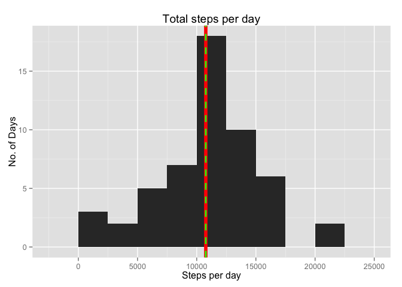
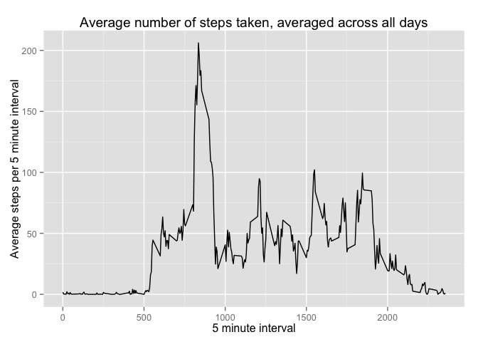
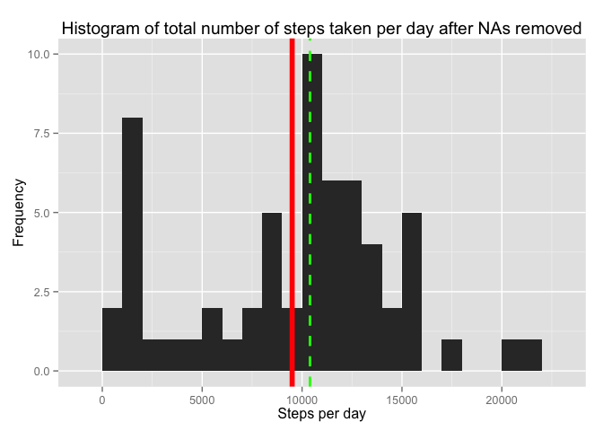
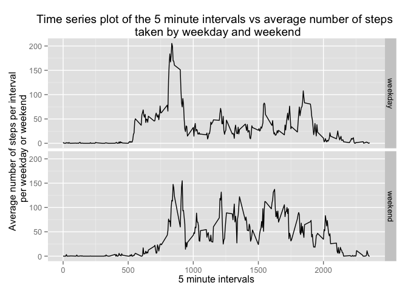

# Reproducible Research: Peer Assessment 1


## Loading and preprocessing the data

Load Libraries and set defaults (install these packages if not currently installed)

```r
library(dplyr)
library(tidyr)
library(reshape2)
library(ggplot2)
library(lubridate)
library(gridExtra)
library(httr)
library(XML)
library(quantmod)
library(pastecs)
library(psych)

options(scipen = 1, digits = 2) # Set default on how R displays numeric results
```


Unzip data and read in data  

```r
unzip("activity.zip") 
data = read.csv("activity.csv", stringsAsFactors=FALSE)
data = tbl_df(data)  # Convert to Table class for use with dplyr and tidyr
```

## Analysis of Data  

### What is mean total number of steps taken per day?  


```r
# Calculate the total steps taken per day
totalStepsPerDay = data %>% 
        group_by(date) %>%
        summarize(Steps_per_day=sum(steps, na.rm = FALSE))

# Calculate mean and median steps per day
meanStepsPerDay = mean(totalStepsPerDay$Steps_per_day, na.rm=T)

medianStepsPerDay = median(totalStepsPerDay$Steps_per_day, na.rm=T)

# Plot histogram of total steps per day and include mean and median on plot 
ggplot(totalStepsPerDay, aes(Steps_per_day)) +
        geom_histogram(binwidth=2500) +
        geom_vline(aes(xintercept=mean(Steps_per_day, na.rm=T)),  # Ignore NA values for mean
                   color="red",  size=2) +
        geom_vline(aes(xintercept=median(Steps_per_day, na.rm=T)),
                   color="green", size=1, linetype="dashed") +
        ggtitle("Total steps per day") +
        xlab("Steps per day") +
        ylab("No. of Days")
```

 

The mean number of steps per day is 10766.19 (red line on plot) and the median is 10765 (dashed green line on plot.

### What is the average daily activity pattern?

Make a time series plot (i.e. type = "l") of the 5-minute interval (x-axis) and the average number of steps taken, averaged across all days (y-axis)  


```r
avgStepsPerInterval =  data %>% 
        group_by(interval) %>%
        summarize(Mean_steps_per_interval=mean(steps, na.rm = TRUE))

ggplot(avgStepsPerInterval, aes(interval, Mean_steps_per_interval)) +
        geom_line() +
        ggtitle("Average number of steps taken, averaged across all days") +
        xlab("5 minute interval") +
        ylab("Average steps per 5 minute interval")
```

 


Which 5-minute interval, on average across all the days in the dataset, contains the maximum number of steps?


```r
intervalWithMaxSteps = avgStepsPerInterval %>% 
       arrange(desc(Mean_steps_per_interval)) %>%
        slice(1)

maxHour = intervalWithMaxSteps[1,1]/12
```

The 5 minute interval, which on average across all the days contains the maximum number of steps is 5 minute interval no. 835.  Note that intervals are designated thusly: 0, 5, 10, ..., 60, 100, 105, 110, ... 2355, and then the next day starts. So 835 would designate 8:35 AM. (A little late for jogging, so maybe the subject walks to work.)

### Imputing missing values  

Note that there are a number of days/intervals where there are missing values (coded as "NA"). The presence of missing days may introduce bias into some calculations or summaries of the data.  

### Calculate and report the total number of missing values in the dataset (i.e. the total number of rows with NAs)  


```r
NAs = data %>%
        filter(is.na(steps))
missingValues = length(NAs$steps)
```
The total number of missing values ("NAs") in the dataset is: 2304.

### Devise a strategy for filling in all of the missing values in the dataset.

The strategy does not need to be sophisticated. For example, you could use the mean/median for that day, or the mean for that 5-minute interval, etc.  Create a new dataset that is equal to the original dataset but with the missing data filled in.    


```r
dataNoNAs = data %>%
        group_by(interval) %>%
        mutate(steps = ifelse(is.na(steps), median(steps, na.rm=T) , steps))
```

As you can see from the code chunk, the NA's are replaced with the median for that 5 minute interval, calculated across all the days.

### Make a histogram of the total number of steps taken each day and calculate and report the mean and median total number of steps taken per day.

Do these values differ from the estimates from the first part of the assignment? What is the impact of imputing missing data on the estimates of the total daily number of steps?  


```r
totalStepsPerDayNoNAs = dataNoNAs %>%
        group_by(date) %>%
        summarize(Steps_per_day=sum(steps, na.rm = FALSE))

meanStepsPerDayNoNAs = mean(totalStepsPerDayNoNAs$Steps_per_day, na.rm=T)

medianStepsPerDayNoNAs = median(totalStepsPerDayNoNAs$Steps_per_day, na.rm=T)


ggplot(totalStepsPerDayNoNAs, aes(Steps_per_day)) +
        geom_histogram(binwidth=1000) +
        geom_vline(aes(xintercept=mean(Steps_per_day, na.rm=T)),  # Ignore NA values for mean
                   color="red",  size=2) +
        geom_vline(aes(xintercept=median(Steps_per_day, na.rm=T)),
                   color="green", size=1, linetype="dashed") +
        ggtitle("Histogram of total number of steps taken per day after NAs removed") +
        xlab("Steps per day") +
        ylab("Frequency")
```

 

The mean number of steps per day with the NA's removed is: 9503.87 (red line on plot) compared with: 10766.19 without the NA's removed.  The median with the NA's removed is: 10395 (dashed green line on plot) compared with: 10765 without the NA's removed.  Note the weird spike on the left of the graph. With the NA's removed and replaced with median values of the intervals, there appear to be more days  where he walked hardly at all. This seems anomalous and warrants further investigation. Perhaps removing the NA's and replacing with median interval values introduced the anomaly. 

### Are there differences in activity patterns between weekdays and weekends?    


```r
dataNoNas1 = dataNoNAs %>%
        mutate(day = wday(date)) %>%
        mutate(day_factor = ifelse(day==1 | day==7 , "weekend" , "weekday")) %>%
        mutate(day_factor = as.factor(day_factor))
```

Make a panel plot containing a time series plot (i.e. type = "l") of the 5-minute interval (x-axis) and the average number of steps taken, averaged across all weekday days or weekend days (y-axis). (See the README file in the GitHub repository to see an example of what this plot should look like using simulated data.)


```r
avgStepsPerIntervalPerDayOfWeek =  dataNoNas1 %>%
        group_by(day_factor,interval) %>%
        summarize(avg_steps_per_interval_per_weekday=mean(steps, na.rm = TRUE))

ggplot(avgStepsPerIntervalPerDayOfWeek, aes(interval,avg_steps_per_interval_per_weekday)) +
        geom_line() +
        facet_grid(day_factor~.) +
        ggtitle("Time series plot of the 5 minute intervals vs average number of steps \n taken by weekday and weekend") +
        xlab("5 minute intervals") +
        ylab("Average number of steps per interval \n per weekday or weekend")
```

 

Looks like the subject often gets up a little later on the weekends to do his jog or walk. He also seems to walk or jog more throughout the day on the weekends.

End of File
